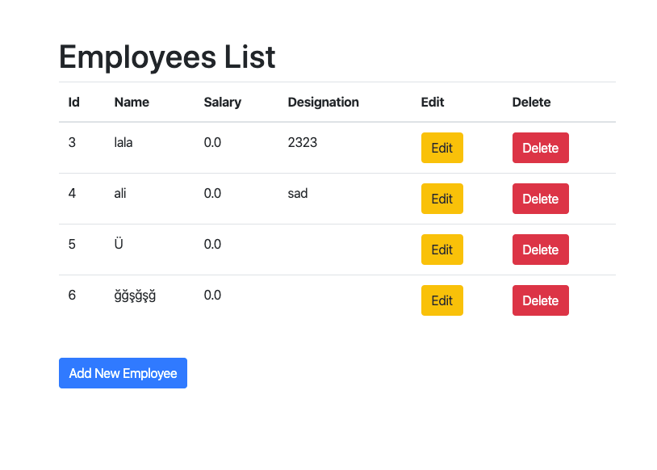

# Spring Framework CRUD Example

## Preparing

Change your database url, database name, database user, and database password in `spring-servlet.xml` file. Then migrate `table.sql` file to your database. To keep this example simple mysql container is not included into the project.

If you don't have mysql server, you can use sqlite. `database.sqlite` file is located at the root of the project. To activate sqlite configurations, open spring-servlet.xml file and uncomment sql diriver bean configuration and comment mysql bean configuration. 

## Build

    mvn clean install
    cp target/SpringCrud.war  [TOMCAT_WEB_SERVER_PATH]/webapps/SpringCrud.war
    // if you used to install tomcat via brew, you can use brew ls tomcat command to find tomcat location
    // When tomcat starts, SpringCrud.war file automaticly will be extracted to SpringCrud_war folder 
    
## Navigate

    http://localhost:8080/SpringCrud_war
    
    
## Docker build

### Build and Run
    mvn clean install && docker build -t spring-crud-example . && docker run -p 8812:8080 --name spring-crud-example-container spring-crud-example
    
    
### Clean Up
    docker container rm -f spring-crud-example-container && docker image rm -f spring-crud-example

### Navigate
    http://localhost:8812/SpringCrud

Employee Index Page

http://localhost:8080/SpringCrud_war/index

