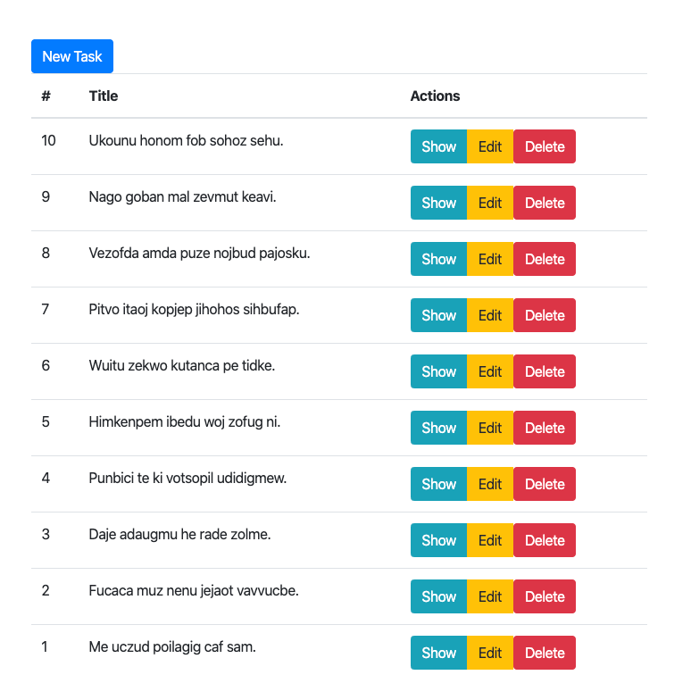

# Task list CRUD Example

## Installation

    git clone --dissociate https://github.com/mahmutbayri/adonisjs-todolist.git
    npm install
    
    cp .env.example .env

Before migration you should update your database configuration in `.env`

    adonis migration:run
    adonis seed
    adonis serve --dev

Then you can navigate `http://localhost:3333/task` url

## Installing as Docker Container

## Build

    docker build -t node-adonisjs .

## Run
    docker run -p 3333:3333 node-adonisjs
    
Then you can navigate `http://localhost:3333/task` url

## Listing page

